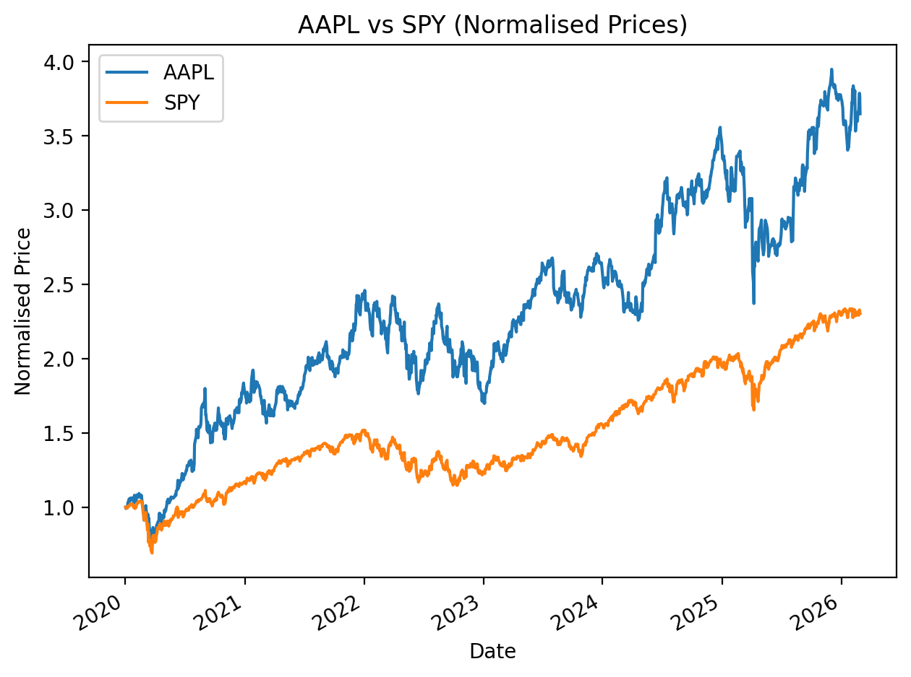
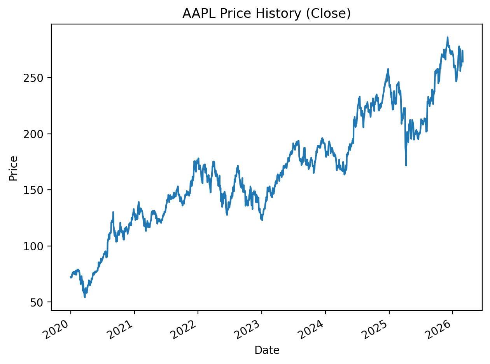
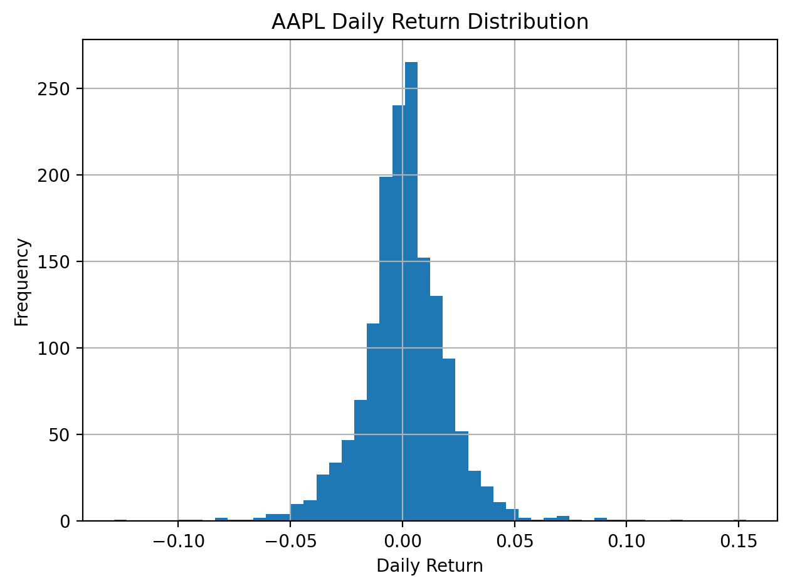
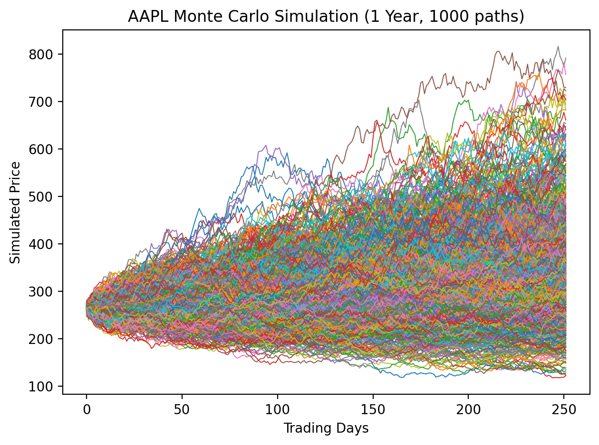

# Python Quant Finance Project

Systematic equity risk analysis using Python and historical market data from Yahoo Finance.

---

## Overview

This project performs quantitative analysis on a selected equity (default: AAPL) and computes:

- Annualised Return
- Annualised Volatility
- Sharpe Ratio
- 95% Value at Risk (VaR)
- Monte Carlo price simulation (1 year horizon)
- Benchmark comparison vs SPY

All visual outputs are automatically saved as image files.

---

## AAPL vs SPY (Normalised Performance)

---

## Price History

---

## Daily Returns Distribution

---

## Monte Carlo Simulation (1 Year, 1000 Paths)

---

## Methodology

- Daily returns computed from adjusted closing prices
- 252 trading days assumed per year
- Risk-free rate set to 2%
- Monte Carlo simulation assumes normally distributed daily returns using historical mean and volatility

---

## Tools Used

- Python
- NumPy
- Pandas
- Matplotlib
- yFinance

---

## Author

Ted Wiseman  
Mechanical Engineer → Quant / Finance Transition  